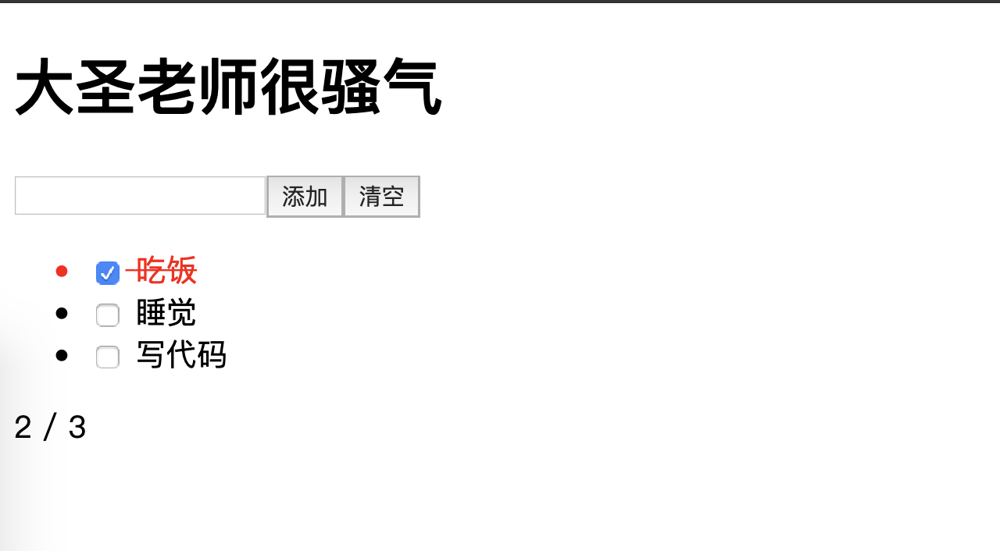
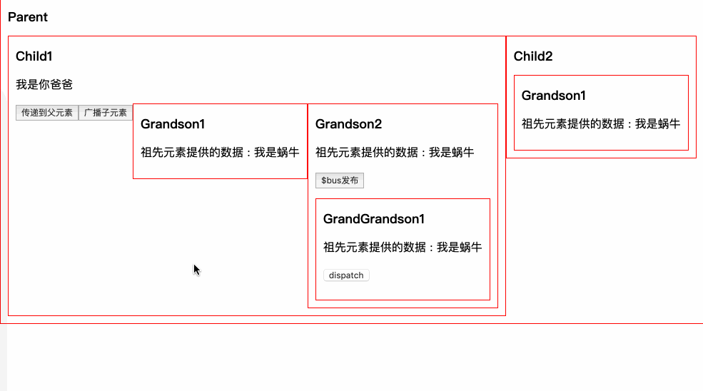

# Vue组件化实战（8:30准时开始）

[TOC]

## 0. 个人介绍

### 讲师介绍

<https://github.com/shengxinjing>


### 课程介绍

不讲基础 魔鬼训练营，希望大家咬牙坚持下去，一定会有明显的变化


## 1. 组件

## 2. 最佳实践

## 3. 原理源码

## 4. 性能优化和部署


## 1. 课前准备

1. Vue官网熟悉
2. 用Vue开发过1个以上的项目


## 2. 课堂主题

1. Vue基础速度扫盲

## 3. 课堂目标


## 4. 知识点


### Vue基础扫盲

通过一个购物车的demo过一下基础api，设计基础点

1. Vue单文件组件
2. 条件渲染，循环渲染
3. 样式和class渲染
4. 组件
5. 事件绑定
6. 计算属性
7. 监听器

```html
<template>
  <div id="app">
    <h1>{{title}}</h1>
    <div>
      <input type="text" v-model="val">
      <button @click="add">添加</button>
      <button @click="clear">清空</button>
    </div>
    <ul>
      <li v-for="todo in todos" :key="todo.title" :class="{done:todo.done}">
        <input type="checkbox" v-model="todo.done">
        {{todo.title}}
      </li>
    </ul>
    <p>{{active}} / {{all}}</p>
  </div>
</template>

<script>
export default {
  name: "app",
  data() {
    return {
      title: "大圣老师很骚气",
      val: "",
      todos: []
    };
  },
  mounted() {
    const todos = localStorage.getItem("todos");
    if (todos) {
      this.todos = JSON.parse(todos);
    } else {
      this.todos = [
        { title: "吃饭", done: true },
        { title: "睡觉", done: false },
        { title: "写代码", done: false }
      ];
    }
  },
  computed: {
    active() {
      return this.todos.filter(v => !v.done).length;
    },
    all() {
      return this.todos.length;
    }
  },
  watch: {
    todos: {
      deep: true,
      handler(todos) {
        localStorage.setItem("todos", JSON.stringify(todos));
      }
    }
  },
  methods: {
    clear() {
      this.todos = this.todos.filter(v => !v.done);
    },
    add() {
      if (this.val) {
        this.todos.push({ title: this.val, done: false });
        this.val = "";
      }
    }
  }
};
</script>
<style>
li.done {
  color: red;
  text-decoration: line-through;
}
</style>

```



### 组件

上面的业务大家也能看到，大概分为两个模块，一个是商品列表，可以添加购物车，一个是购物车页面，可以对购物车内部的商品做增删改查，都在一个页面里，代码很复杂，所以组件化，是Vue进阶中首先要要学习的技能

还是那句话，组件的官方文档这里就不介绍了 ， <https://cn.vuejs.org/v2/guide/components.html> 大家自行去看，下面我们先说组件设计中第一个老生常谈的问题，Vue的组件化通信方式


#### 1.父传子


Props 文档基本操作

```vue
// App
<template>
  <div id="app">
    <Child1 :title="title1"></Child1>
  </div>
</template>

<script>
import Child1 from '@/components/Child1'
export default {
  name: "app",
  data(){
    return {
      title1:'我是你爸爸'
    }
  },
  components:{Child1}

}
</script>
```

```vue
// Child1
<template>
    <div>
        <h2>Child2</h2>
        <div>{{title}}</div>
    </div>
</template>
<script>
export default {
    props:['title']
    
}
</script>
```


####  2. 子传父

Vue更推荐单向数据流，所以子组件像修改传递的数据，需要通知父组件来修改，使用$emit触发父元素传递的事件


```html
<template>
  <div id="app">
    <h2>Parent</h2>
    <h3>{{msg}}</h3>
    <Child1 :title="title1" @getmsg="getmsg"></Child1>
  </div>
</template>

<script>
import Child1 from '@/components/Child1'
export default {
  name: "app",
  data(){
    return {
      msg:'',
      title1:'我是你爸爸'
    }
  },
  methods:{
    getmsg(msg){
      console.log(msg)
      this.msg = msg
    }
  },
  components:{Child1}

}

</script>
<style>

div{
  border:1px red solid;
  padding:20px;
}
</style>
```


```html
// child1
<template>
    <div>
        <h2>Child2</h2>
        <p>{{title}}</p>
        <button @click="toParent">传递到父元素</button>
    </div>
</template>
<script>
export default {
    props:['title'],
    methods:{
        toParent(){
            this.$emit('getmsg','爸爸,我知道错了')
        }
    }
    
}
</script>
```


####  3. 兄弟组件

兄弟组件不能直接通信，只需要父元素搭个桥即可，大家自己体验即可


#### 4. 祖先后代  provide & inject


props一层层传递，爷爷给孙子还好，如果嵌套了五六层还这么写，感觉自己就是一个沙雕，所以这里介绍一个 稍微冷门的API， [provice/inject](https://cn.vuejs.org/v2/api/#provide-inject),类似React中的上下文，专门用来跨层级提供数据


现在很多开源库都使用这个api来做跨层级的数据共享，比如element-ui的[tabs](https://github.com/ElemeFE/element/blob/efcfbdde0f06e3e1816f1a8cd009a4e413e6e290/packages/tabs/src/tabs.vue#L26) 和 [select](https://github.com/ElemeFE/element/blob/f55fbdb051f95d52e92f7a66aee9a58e41025771/packages/select/src/select.vue#L161)

```html


<script>
import Child1 from '@/components/Child1'
export default {
  name: "app",
  provide:{
    woniu:'我是骚气的大圣'
  },
  components:{Child1}
}

</script>
<style>
```


```html
// 子孙元素
<template>
    
    <div>
        <h3>Grandson1</h3>
        <p>
            祖先元素提供的数据 : {{woniu}}
        </p>
    </div>
</template>
<script>
export default {
    
    inject:['woniu']
}
</script>
```


但是provider和inject不是响应式的，如果子孙元素想通知祖先，就需要hack一下，Vue1中有dispatch和boardcast两个方法，但是vue2中被干掉了，我们自己可以模拟一下

原理就是可以通过this.$parent和this.​$children来获取父组件和子组件，我们递归一下就可以了


####  5. dispatch

递归获取$parent即可  比较简单


```html
<button @click="dispatch('dispatch','哈喽 我是GrandGrandChild1')">dispatch</button>
```

```js
  methods: {

    dispatch(eventName, data) {
      let parent = this.$parent
      // 查找父元素
      while (parent ) {
        if (parent) {
          // 父元素用$emit触发
          parent.$emit(eventName,data)
          // 递归查找父元素
          parent = parent.$parent
        }else{
          break
        }
      }
 
    }
  }
```


注意只向上传递了，并没有影响别的元素


####  6. boardcast

和dispatch类似，递归获取$children 来向所有子元素广播

```html
<button @click="$boardcast('boardcast','我是Child1')">广播子元素</button>
```


```js
function boardcast(eventName, data){
  this.$children.forEach(child => {
    // 子元素触发$emit
    child.$emit(eventName, data)
    if(child.$children.length){
      // 递归调用，通过call修改this指向 child
      boardcast.call(child, eventName, data)
    }
  });
}
{
  methods: {

    $boardcast(eventName, data) {
      boardcast.call(this,eventName,data)
    }
  }
}
```


#####   全局挂载dispatch和boardcast

想用的时候，需要自己组件内部定理dispatch和boardcast太烦了，我们挂载到Vue的原型链上，岂不是很high,找到main.js


```js
Vue.prototype.$dispatch =  function(eventName, data) {
  let parent = this.$parent
  // 查找父元素
  while (parent ) {
    if (parent) {
      // 父元素用$emit触发
      parent.$emit(eventName,data)
      // 递归查找父元素
      parent = parent.$parent
    }else{
      break
    }
  }
}

Vue.prototype.$boardcast = function(eventName, data){
  boardcast.call(this,eventName,data)
}
function boardcast(eventName, data){
  this.$children.forEach(child => {
    // 子元素触发$emit
    child.$emit(eventName, data)
    if(child.$children.length){
      // 递归调用，通过call修改this指向 child
      boardcast.call(child, eventName, data)
    }
  });
}

```

这样组件里直接就可以用了 无压力


####  7. 没啥关系的组件：event-bus

如果俩组件没啥关系呢，我们只能使用订阅发布模式来做，并且挂载到Vue.protytype之上，我们来试试，我们称呼这种机制为总线机制，也就是喜闻乐见的 event-bus

```js

class Bus{
  constructor(){
    // {
    //   eventName1:[fn1,fn2],
    //   eventName2:[fn3,fn4],
    // }
    this.callbacks = {}
  }
  $on(name,fn){
    this.callbacks[name] = this.callbacks[name] || []
    this.callbacks[name].push(fn)
  }
  $emit(name,args){
    if(this.callbacks[name]){
      // 存在 遍历所有callback
      this.callbacks[name].forEach(cb=> cb(args))
    }
  }
}

Vue.prototype.$bus = new Bus()
```


使用

```js
// 使用
eventBus(){
    this.$bus.$emit('event-bus','测试eventBus')
}

// 监听
this.$bus.$on("event-bus",msg=>{
    this.msg = '接收event-bus消息:'+ msg
})
```




其实本身Vue就是一个订阅发布的实现，我们偷个懒，把Bus这个类可以删掉，新建一个空的Vue实例就可以啦

```js

Vue.prototype.$bus = new Vue()
```


####  8. vuex

实际开发项目，vuex就是最佳实践，咱们下次课会详细介绍 敬请期待


### element-ui组件库体验

- Element-UI：<http://element-cn.eleme.io/>
- element集成：vue add element
- 组件使用：创建一个登陆表单并可以校验用户输入

```html

    <el-form :model="model" :rules="rules" ref="loginForm">
      <el-form-item label="用户名" prop="username">
        <el-input v-model="model.username" autocomplete="off"></el-input>
      </el-form-item>
      <el-form-item label="确认密码" prop="password">
        <el-input type="password" v-model="model.password" autocomplete="off"></el-input>
      </el-form-item>
      <el-form-item>
        <el-button type="primary" @click="submitForm('loginForm')">提交</el-button>
      </el-form-item>
    </el-form>


```

```js

export default {
  data() {
    return {
      model: { username: "大圣小老弟", password: "" },
      rules: {
        username: [{ required: true, message: "请输入用户名" }],
        password: [{ required: true, message: "请输入密码" }],
      }
    };
  },
  methods: {
      submitForm(form) {
          this.$refs[form].validate(valid=>{
              if (valid) {
                  alert('请求登录!')
              } else {
                  alert('校验失败！')
              }
          })
      }
  },
};

```

用到了3个组件，咱们思考几个问题

1. el-Input是自定义组件，它是怎么实现双向绑定的？组件竟然还可以v-model
2. FormItem是怎么知道执行校验的，它是怎么知道Input状态的？它是怎么获得对应数据模型的？
3. Form是怎么进行全局校验的？它用什么办法把数据模型和校验规则传递给内部组件？


### 实现k-input

大家看过官网就知道，v-model是语法糖，实现自定义组件双绑需要指定:value和@input即可,  并且还需要通知父组件


```html
<template>
    <div>
        <input :type="type" :value="value" @input="onInput">
    </div>
</template>

<script>
    export default {
        props: {
            value: {
                type: String,
                default: ''
            },
            type: {
                type: String,
                default: 'text'
            },
        },
        methods: {
            onInput(e) {
                // 派发事件，通知父组件输入值变化
                this.$emit('input', e.target.value)

                // 通知父组件校验
                this.$parent.$emit('validate')
            }
        },
    }
</script>

<style scoped>

</style>
```

```html
    <h1>{{name}}</h1>
    <k-input v-model="name"></k-input>
```


### 实现k-form-item

1. 预留插槽，扩展input
2. 能够展示label和校验的错误信息
3. 能够进行校验

```html
<template>
  <div>
    <label v-if="label">{{label}}</label>
    <slot></slot>
    <p v-if="error">{{error}}</p>
  </div>
</template>

<script>
export default {
    props: {
        label: {// 输入项标签
            type: String,
            default: ''
        },
        prop: {// 字段名
            type: String,
            default: ''
        },
    },
    data() {
        return {
            error: '' // 校验错误
        }
    },
};
</script>
```


```html
    <k-form-item label="用户名">
      <k-input v-model="name"></k-input>
    </k-form-item>
```

### 实现Form

- 给form-item预留槽位
- 将数据传递给后代便于它们访问数据模型和校验规则
  - provide && inject


```html
<template>
  <form>
    <slot></slot>
  </form>
</template>

<script>
export default {
  provide() {
    return {
      form: this // 将组件实例作为提供者，子代组件可方便获取
    };
  },
  props: {
    model: { type: Object, required: true },
    rules: { type: Object }
  }
};
</script>
```

数据校验

- 思路：校验发生在FormItem，它需要知道何时校验（让Input通知它），还需要知道怎么校验（注入校验规则）
- 任务1：Input通知校验

```js
onInput(e) {
	// ...
	// $parent指FormItem
	this.$parent.$emit('validate');
}
```

任务2：FormItem监听校验通知，获取规则并执行校验

```js
inject: ['form'], // 注入
mounted(){// 监听校验事件
	this.$on('validate', this.validate)
},
methods: {
	validate() {
		// 获取对应FormItem校验规则
		console.log(this.form.rules[this.prop]);
        // 获取校验值
        console.log(this.form.model[this.prop]);
	}
},
```

```js
import schema from "async-validator";

validate() {
      // 获取对应FormItem校验规则
      const rules = this.form.rules[this.prop];
      // 获取校验值
      const value = this.form.model[this.prop];
      // 校验描述对象
      const descriptor = { [this.prop]: rules };
      // 创建校验器
      const schema = new Schema(descriptor);
      schema.validate({ [this.prop]: value }, errors => {
        if (errors) {
          // 将错误信息显示
          this.error = errors[0].message;
        } else {
          // 校验通过
          this.error = "";
        }
      });
}
```

任务3：表单全局验证

- 改造FormItem的validate方法，使其可以返回Promise

```js
	validate() {
      return new Promise((resolve, reject) => {
        // ...
        schema.validate({ [this.prop]: value }, errors => {
          if (errors) {// 校验失败
            reject()
          } else { // 校验通过
            resolve();
          }
        });
      });
    }
```

为Form提供validate方法

```js
	validate(cb) {
      // 调用所有含有prop属性的子组件的validate方法并得到Promise数组
      const tasks = this.$children
        .filter(item => item.prop)
        .map(item => item.validate());
      // 所有任务必须全部成功才算校验通过，任一失败则校验失败
      Promise.all(tasks)
        .then(() => cb(true))
        .catch(() => cb(false));
    }
```

```html
<k-form-item>
	<el-button type="primary" @click="submitForm('kLoginForm')">提交</el-button>
</k-form-item>
```

#### 扩展

组件内部也可能嵌套，this.$parent改成 this.$diapsth更靠谱 

```html
      <k-form-item label="用户名" prop="username">
          <Demo>
          <k-input v-model="model.username"></k-input>

          </Demo>
      </k-form-item>
```

```js
onBlur(e){
    this.$dispatch('validate')
},
    
```

引入了async-validator，所以支持更多的检验规则

```js
rules: {
    username: [
        { required: true, message: "请输入用户名" },
        { type: 'email', message: '邮箱格式不正确' }
    ],
    password: [{ required: true, message: "请输入密码" }],
}
```

### element的表单源码

/src/mixins/emitter.js

/packages/form

/packages/input ( watch value  , handleBlur)


###  为什么要测试？

组件的单元测试有很多好处：

- 提供描述组件行为的文档
- 节省手动测试的时间
- 减少研发新特性时产生的 bug
- 改进设计
- 促进重构

自动化测试使得大团队中的开发者可以维护复杂的基础代码。

测试的思路 无非就是

### 弹窗

element的组件，除了template中写，还可以在JS种直接调用的

```javascript
        this.$notify({
          title: '提示',
          message: '这是一条不会自动关闭的消息',
          duration: 0
        });
```


这种方式在其他ui库，比如cube-ui，也是非常有特色的功能

#### 普通的弹窗

```html
<template>
    <div class='box'>
        <div class="box-content">
          <slot></slot>
        </div>
    </div>
</template>

<script>
export default {
  
}
</script>

<style>
    .box{
        position: fixed;
        width: 100%;
        top: 16px;
        left: 0;
        text-align: center;
        pointer-events: none;
    }
    .box-content{
        width:200px;
        margin:10px auto;
        font-size:14px;
        border:blue 3px solid;
        padding: 8px 16px;
        background: #fff;
        border-radius: 3px;
        margin-bottom: 8px;
    }
</style>
```


想用类似window.alert的方式使用，我们需要手动控制$mount的实际，在执行this.​$alert的时候， 再去挂载这个组件，并且能够传递相应的数据, 

组件渲染数组，提供add和remove来添加和删除信息


```html
<template>
    <div class="alert">
            <div class="alert-content" v-for="item in notices" :key="item.name" >{{ item.content }}</div>
    </div> 
</template>
<script>
    let seed = 0;

    export default {
        data () {
            return {
                notices: []
            }
        },
        methods: {
            add (notice) {
                let id = 'k_' + (seed++)
                this.notices.push({
                  ...notice,
                  id 
                })

                const duration = notice.duration;
                setTimeout(() => {
                    this.remove(id);
                }, duration * 1000);
            },
            remove (id) {
                const notices = this.notices;
                for (let i = 0; i < notices.length; i++) {
                    if (notices[i].id === id) {
                        this.notices.splice(i, 1);
                        break;
                    }
                }
            }
        }
    }
</script>
<style>
    .alert{
        position: fixed;
        width: 100%;
        top: 16px;
        left: 0;
        text-align: center;
        pointer-events: none;
    }
    .alert-content{
        width:200px;
        margin:10px auto;
        font-size:14px;
        border:blue 3px solid;
        padding: 8px 16px;
        background: #fff;
        border-radius: 3px;
        margin-bottom: 8px;
    }
</style>
```


#### JS调用 动态渲染

弹窗还有一个特殊的情况，就是必须要渲染在body上，如果在当前组件内部渲染， 当前组件的transform等属性，会影响表单，我们提供一个渲染到body的方法，newInstance

```js
import Notice from './Notice.vue';
import Vue from 'vue';

Notice.newInstance = properties => {
    const props = properties || {};

    const Instance = new Vue({
        data: props,
        render :h=> <Notice props={props} />
    });
	// 手动mount
    const component = Instance.$mount();
    document.body.appendChild(component.$el);

    const notice = Instance.$children[0];

    return {
        add (noticeProps) {
            notice.add(noticeProps);
        },
        remove (name) {
            notice.remove(name);
        }
    }
};

export default Notice;
```

对外暴露info方法


```js
import Message from './message.js';

let instance;

function notice({ duration = 1.5, content = '' }) {
    instance = instance || Message.newInstance();
    instance.add({
        content: content,
        duration: duration
    });
}

export default {
    info (options) {
        return notice(options);
    }
}
```

main.js挂载原型链

```js

Vue.prototype.$Notice = Notice
```

使用贼简单

```js
        this.$Notice.info({
            content: '必须的！',
            duration: 2
        });
```

### 递归组件Tree

我们经常见到的tree组件，无限导航都是感觉一样的组件，嵌套很多层，这里就有一个组件递归的概念， 和函数的递归一样，自己调用自己，类似俄罗斯套娃，在某个条件下终止这个递归即可

```html
<template>

<div>
          <Node
            v-for="(item, index) in data"
            :key="index"
            :data="item"
        ></Node>
</div>
</template>

<script>
import Node from './Node'
export default {
  components:{
    Node
  },
  data() {
    return {
      data: [
        {
          title:'Java架构师'
        },
        {
          title:'JS高级',
          expand: true,
          children:[
            {
              title:'ES6',
            },
                        {
              title:'动效',
            }
          ]
        },
        {
          title: "Web全栈",
          children: [
            {
              title: "Vue训练营",
              expand: true,
              children: [
                {
                  title: "组件化"
                },
                {
                  title: "源码"
                },
                       {
                  title: "docker部署"
                }
              ]
            },
            {
              title: "React",
              children: [
                {
                  title: "JSX"
                },
                {
                  title: "虚拟DOM"
                }
              ]
            },
            {
              title:'Node'
            }
          ]
        }
      ]
    };
  }
};
</script>

<style>
</style>

```


Node.vue

```html
<template>
  <ul>
    <li class="tree-li">
      <span @click="toggle">{{ data.title }}</span>
      <Node v-if="showSub" v-for="(item, index) in data.children" :key="index" :data="item"></Node>
    </li>
  </ul>
</template>

<script>
export default {
  name: "Node",
  props: ["data"],
  methods: {
    toggle() {
      this.showSub = !this.showSub;
    }
  },
  data() {
    return {
      showSub: true
    };
  }
};
</script>

<style>
</style>

```


## 5. 扩展

element源码

## 6. 总结

[TOC]

## 7. 作业

1. 选择题
2. 思考题(不做考核要求，第二天开课前讲解)
   1. 递归组件如果加checkbox全选，如何实现

## 8. 问答


## 9. 预告

Vue最佳实践

1. 学完后掌握Vue技术栈的方方面面
2. 路由守卫
3. mock数据
4. 权限设计
5. 复杂项目中的Vue实战