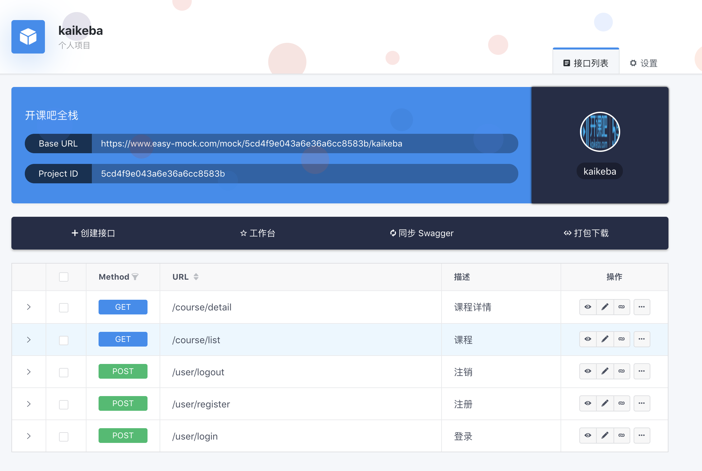
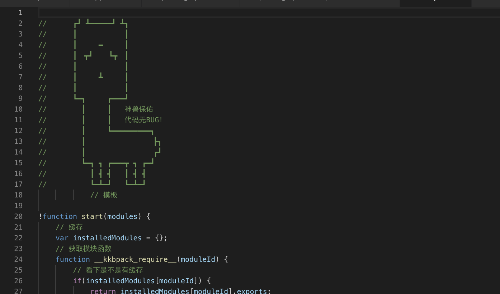

# Vue.js最佳实践

[TOC]


## 0. 作业

1. 测试题不用每个都答对，目的不是分数，是思考和讨论的过程 只要做了都返钱
2. 答的不好不要气馁，思考


1、关于MVVM的理解，下列哪项是不正确的？(D)[单选题]
A、Model代表数据模型，也可以在Model中定义数据修改和操作的业务逻辑。
B、View代表UI 组件，它负责将数据模型转化成UI 展现出来。
C、ViewModel 监听模型数据的改变和控制视图行为、处理用户交互。
D、在MVVM架构下，开发者完全不需要手动操作DOM，数据状态的同步由MVVM管理。

scroll focus 咱们第一次课做的弹窗，都需要手动操作


2、关于Vue的生命周期，下列哪项是不正确的？(B)[单选题]
A、Vue 实例从创建到销毁的过程，就是生命周期。
B、页面首次加载会触发beforeCreate, created, beforeMount, mounted, beforeUpdate, updated。
C、created表示完成数据观测，属性和方法的运算，初始化事件，$el属性还没有显示出来。
D、DOM 渲染在 mounted 中就已经完成了。

beforeUpdate, updated。这个是更新

3、关于Vue组件间的参数传递，下列哪项是不正确的？(C)[单选题]
A、子组件给父组件传值，使用$emit方法
B、子组件使用​$emit('someEvent')派发事件，父组件使用@someEvent监听
C、祖孙组件间可以使用provide和inject方式跨层级相互传值 
D、父组件给子组件传值，子组件通过props接受数据

不能相互 再解释一下$emit

4、下列关于v-model的说法，哪项是正确的？(BD)[多选题]
A、v-model只能用于表单控件，实现双向数据绑定
B、v-model本质上是语法糖，它实现了用户的输入事件监听以及数据更新
C、v-model是内置指令，不能用在自定义组件上
D、对input使用v-model实际上是指定其:value和@input

我敲错了，也算是检验大家学习成果，嗯 是这样的


5、下列说法正确的是哪项？(ACD)[多选题]
A、key的作用主要是为了高效的更新虚拟DOM
B、若指定了组件的template选项，render函数不会执行
C、使用vm.$nextTick可以确保获得DOM异步更新的结果
D、若没有el选项，vm.​$mount(dom)可将Vue实例挂载于指定元素上

render优先级高


思考题

dispatch boardcast

进阶思考题  

如何做到子元素全选后，父元素自动全选？


## 1. 课前准备

回顾

provide && inject

$emit 

组件化

项目基础


## 2. 课堂主题

1. vue-cli
2. webpack
3. vuex
4. vue-router
5. 工作流
6. 权限


## 3. 课堂目标


## 4. 知识点

### 规范

文件名，约定好即可

```bash
├── build                      // 构建相关  
├── config                     // 配置相关
├── mock                      // 假数据
├── src                        // 源代码
│   ├── api                    // 所有网络请求
│   ├── assets                 // 主题 字体等静态资源
│   ├── components             // 全局公用组件
│   ├── filtres                // 全局 filter
│   ├── icons                  // 项目icons
│   ├── router                 // 路由
│   ├── store                  // 全局 store管理
│   ├── styles                 // 全局样式
│   ├── utils                  // 全局公用方法
│   ├── vendor                 // 公用vendor
│   ├── views                   // 页面view
│   ├── App.vue                // 入口页面
│   └── main.js                // 入口 加载组件 初始化等
├── static                     // 第三方不打包资源
│   └── Tradingview                // 富文本
├── .babelrc                   // babel-loader 配置
├── eslintrc.js                // eslint 配置项
├── .gitignore                 // git 忽略项
```

这个没啥太多说的，记得页面级的组件， 放在view里，公用放在components


### 数据mock的姿势


1. vue-cli假数据，利用webpack-dev-server中内置的express

```js
module.exports = {
  configureWebpack: {
    // 扩展webpack
    devServer: {
      before(app) {
        // app其实就是个exoress
        app.get('/api/goods', function (req, res) {
          res.json({
            list: [
              { text: '百万年薪架构师', price: 100 },
              { text: 'web全栈架构师', price: 80 },
              { text: 'Python爬虫', price: 60 }
            ]
          });
        });
      }
    }
  }
}
```


2. easy-mock + proxy

开发项目大部分 都会采用swagui 或者easy-mock这种接口文档工具


### vue-cli

```bash
➜  ~ vue
Usage: vue <command> [options]

Options:
  -V, --version                              output the version number
  -h, --help                                 output usage information

Commands:
  create [options] <app-name>                create a new project powered by vue-cli-service
  add [options] <plugin> [pluginOptions]     install a plugin and invoke its generator in an already created project
  invoke [options] <plugin> [pluginOptions]  invoke the generator of a plugin in an already created project
  inspect [options] [paths...]               inspect the webpack config in a project with vue-cli-service
  serve [options] [entry]                    serve a .js or .vue file in development mode with zero config
  build [options] [entry]                    build a .js or .vue file in production mode with zero config
  ui [options]                               start and open the vue-cli ui
  init [options] <template> <app-name>       generate a project from a remote template (legacy API, requires @vue/cli-init)
  config [options] [value]                   inspect and modify the config
  upgrade [semverLevel]                      upgrade vue cli service / plugins (default semverLevel: minor)
  info                                       print debugging information about your environment

  Run vue <command> --help for detailed usage of given command.
```

常用的还是vue create 具体vue cli工作的流程我们可以后面分析，重点要掌握内部核心还是webpack来实现



baseurl + 接口url

<https://www.easy-mock.com/mock/5cd4f9e043a6e36a6cc8583b/kaikeba/course/list>


```js
        proxy: {
            '/easymock': {
                target: ' https://www.easy-mock.com/mock/5cd4f9e043a6e36a6cc8583b/kaikeba',
                changeOrigin: true,
                ws: true,
                pathRewrite: {
                  '^/easymock': ''
                }
            }
          }
```


后端的开发环境，调试接口 ，除了proxy，还可以让后端直接开启跨域


```js
const express = require('express');
const app = express();

// //设置允许跨域访问该服务.
app.all('*', function (req, res, next) {
  res.header('Access-Control-Allow-Origin', '*');
  res.header('Access-Control-Allow-Headers', 'Content-Type');
  res.header('Access-Control-Allow-Methods', '*');
  res.header('Content-Type', 'application/json;charset=utf-8');
  next();
});

app.get('/api/goods', function (req, res) {
    res.json({
        title:'正式环境',
      list: [
        { text: '百万年薪架构师', price: 100 },
        { text: 'web全栈架构师', price: 8000 },
        { text: 'Python爬虫', price: 60 }
      ]
    });
});

const server = app.listen(9082, function () {
  console.log('Express app server listening on port %d', server.address().port);
});
```

还可以直接用mockjs  

### npm scripts + git hooks

npm run lint 校验规则，每次手动执行太麻烦，我们希望做的，git的代码里保持纯净就可以，所以我们使用git hook 在commit代码之前，进行校验，lint不通过就不让commit

我们使用husky支持更多的 Git Hooks 种类，再结合 [lint-staged](https://link.juejin.im/?target=https%3A%2F%2Fgithub.com%2Fokonet%2Flint-staged) 

```js
npm i husky lint-staged -D
```


装完就发现.git/hooks/precommit被husky改写了

```bash
➜  hooks git:(master) cat pre-commit
#!/bin/sh
# husky

# Hook created by Husky
#   Version: 2.3.0
#   At: 2019-5-30 17:54:05
#   See: https://github.com/typicode/husky#readme

# From
#   Directory: /Users/woniuppp/github/vue-master-lesson/02/node_modules/husky
#   Homepage: https://github.com/typicode/husky#readme
```


刻意写点不符合要求的代码，commit就失败了


```bash

npm ERR! A complete log of this run can be found in:
npm ERR!     /Users/woniuppp/.npm/_logs/2019-05-30T10_21_19_674Z-debug.log
husky > pre-commit hook failed (add --no-verify to bypass)
```

 lint-staged 改进 pre-commit

每次commit，都跑全量的eslint，大型项目会贼慢，而且如果推进新规范，上来就好几千个报错，基本不可行，可以使用 lint-staged ，只检查当前git中改动的文件

```json
"precommit": "lint-staged",
```

```json
  "lint-staged": {
    "*.js": "eslint",
    "*.less": "stylelint",
    "*.css": "stylelint",
    "*.json": "jsonlint --quiet",
    "*.md": "markdownlint --config .markdownlint.json"
  },
```

一切都可以lint


git push配合docker自动化部署 第四天再唠   大家可以事先了解一下github webhook

### webpack

vue-cli本身就是基于webpack，复杂项目中，还是需要对vue.config.js中做扩展，所以要求我们要对webpack也要足够熟悉， 基本的配置没啥说的，rules,alise entry,output啥的


简单看一下webpack build之后的代码

```js

​```js
(function(modules) { // webpackBootstrap
	// The module cache
	var installedModules = {};
	// The require function
	function __webpack_require__(moduleId) {
		// Check if module is in cache
		if(installedModules[moduleId]) {
			return installedModules[moduleId].exports;
		}
		// Create a new module (and put it into the cache)
		var module = installedModules[moduleId] = {
			i: moduleId,
			l: false,
			exports: {}
		};
		// Execute the module function
		modules[moduleId].call(module.exports, module, module.exports, __webpack_require__);
		// Flag the module as loaded
		module.l = true;q
		// Return the exports of the module
		return module.exports;
	}

	// Load entry module and return exports
	return __webpack_require__(__webpack_require__.s = "./src/index.js");
})({
 "./src/a.js":(function(module, exports) {

eval("module.exports = (name)=>{\n    console.log('hello '+name)\n}\n\n//# sourceURL=webpack:///./src/a.js?");

}),

"./src/index.js":(function(module, exports, __webpack_require__) {

eval("\nconst sayHi = __webpack_require__(/*! ./a.js */ \"./src/a.js\")\n\n\nsayHi('开课吧')\n\n//# sourceURL=webpack:///./src/index.js?");

/***/ })

});
​```


```


大概的意思就是，我们实现了一个__webpack_require__ 来实现自己的模块化，把代码都缓存在installedModules里，代码文件以对象传递进来，key是路径，value是包裹的代码字符串，并且代码内部的require，都被替换成了__webpack_require__,  如何自己写一个webpack，实现这些打包的逻辑，全栈课的工程化章节有手敲实战，今天简单介绍一下


1. loader

load是一个函数，做文件转换的

```js
const marked = require("marked");
const loaderUtils = require("loader-utils");

module.exports = function (markdown) {
    // 使用 loaderUtils 来获取 loader 的配置项
    // this 是构建运行时的一些上下文信息
    const options = loaderUtils.getOptions(this);

    this.cacheable();

    // 把配置项直接传递给 marked
    marked.setOptions(options);

    // 使用 marked 处理 markdown 字符串，然后返回
    return marked(markdown);
};
```


1. plugins

plugin 的实现可以是一个类， plugin 实例中最重要的方法是 `apply`，该方法在 webpack compiler 安装插件时会被调用一次，`apply` 接收 webpack compiler 对象实例的引用，你可以在 compiler 对象实例上注册各种事件钩子函数，来影响 webpack 的所有构建流程，以便完成更多其他的构建任务。

一个加蛋疼注释的plugin


```js

class Banner{
    constructor(content){
        this.content = content
    }

    apply(compiler){
        console.log('plugin执行拉')
        compiler.hooks.run.on(()=>{
            console.log('任务开始跑了')
        })
        compiler.hooks.emit.on(()=>{
            console.log(compiler.template)
            compiler.template = `
//      ┏┛ ┻━━━━━┛ ┻┓
//      ┃　　　　　　 ┃
//      ┃　　　━　　　┃
//      ┃　┳┛　  ┗┳　┃
//      ┃　　　　　　 ┃
//      ┃　　　┻　　　┃
//      ┃　　　　　　 ┃
//      ┗━┓　　　┏━━━┛
//        ┃　　　┃   神兽保佑
//        ┃　　　┃   代码无BUG！
//        ┃　　　┗━━━━━━━━━┓
//        ┃　　　　　　　    ┣┓
//        ┃　　　　         ┏┛
//        ┗━┓ ┓ ┏━━━┳ ┓ ┏━┛
//          ┃ ┫ ┫   ┃ ┫ ┫
//          ┗━┻━┛   ┗━┻━┛
            `+compiler.template
            // compiler.template = `/** ${this.content} */\n`+compiler.template
            console.log('完成啦 还没写文件')
        })
        compiler.hooks.done.on(()=>{
            // consol
            console.log('写文件结束')
        })
    }
}

module.exports = Banner
```



如何提高webpack编译速度和产出代码的性能，属于性能优化范畴


### 项目规范最佳实践


### vuex


上次文章介绍了Vue组件化之间通信的各种姿势，虽然2.4更新了Listeners和$attrs 其中vuex基本算是终极解决方案了，这个没啥说的，直接贴代码把 


所谓各大框架的数据管理框架，原则上来说，就是独立团大了，所有事都团长处理太累了，所以老李只管军事，枪弹烟酒面这些数据，交给赵政委，赵政委就是咱们的Vuex，从此以后 全团共享的数据，都必须得经过赵政委统一进行调配

我的风格就是用过的东西，都喜欢造个轮子，实战使用 只是基础而已，话不多说看代码

```js

// store.js
import Vue from 'vue'
import Vuex from 'vuex'

Vue.use(Vuex)
export default new Vuex.Store({
  state: {
    count: 0
  },
  mutations: {
    increment (state,n=1) {
      state.count += n
    }
  },
  actions:{
    incrementAsync({commit}){
      setTimeout(()=>{
        commit('increment',2)
      },1000)
    }
  }
})
```


```js

// main.js
import Vue from 'vue'
import App from './App.vue'
import store from './store'
Vue.config.productionTip = false

new Vue({
  store,
  render: h => h(App),
}).$mount('#app')
​```

​```html
<template>
  <div id="app">
    <div>冲啊，手榴弹扔了{{$store.state.count}}个</div>
    <button @click="add">扔一个</button>
    <button @click="addAsync">蓄力扔俩</button>
  </div>
</template>
<script>

export default {
  name: 'app',

  methods:{
    add(){
      this.$store.commit('increment')
    },
    addAsync(){
      this.$store.dispatch('incrementAsync')
    }
  }
}
</script>
```


Vue.use(Vuex)，这是vue安装插件的机制，需要Vuex对外暴露一个install方法，会把Vue传递给install这个函数，咱们来小小的测试一下下

先看下vue.use的源码 /src/core/global-api/use.js

其实就是把传递插件的install方法执行一下，存储在一个插件数组中， 传递Vue进去，我们可以利用这个机制，对Vue本身进行扩展

```js
class Store {
  constructor() {
    this.name = '赵政委'
  }
}


function install(Vue) {
  Vue.prototype.$store = new Store()
}
export default { Store, install }
```

```html
<template>
  <div id="app">
  </div>
</template>
<script>

export default {
  name: 'app',
  created(){
    console.log(this.$store)
  }
}
</script>
// output Store {name: "赵政委"}
```

真正使用的时候，store是通过new Vue传递进来的，我们需要使用mixin在beforeCreated来挂载，这样才能通过this.$option获取传递进来的store

```js
class Store {
  constructor() {
    this.name = '赵政委'
  }
}

function install(Vue) {
  Vue.mixin({
    beforeCreate(){
      // 这样才能获取到传递进来的store
      // 只有root元素才有store，所以判断一下
      if(this.$options.store){
        Vue.prototype.$store = store

      }
    }
  })
  // console.log(this)
}
export default { Store, install }
```


```js
import Vue from 'vue'
import Vuex from './vuex'

Vue.use(Vuex)
export default new Vuex.Store()
```

修改数据

并且需要通知到组件，这个需要数据是响应式的，我们需要Vue的响应式支持，所以这里也可以看到Vuex是和Vue强绑定的，不能脱离vue单独使用

由于install的时候会传递一个Vue，我们维护一个全局变量，就不用再import vue了，如果vuex.js单独发布，减小包体积

mutation实现也比较简单，记录一下mutation的函数，commit的时候更新数据即可

```js
let Vue
class Store {
  constructor(options={}) {
    // this.name = '赵政委'
    this.state = options.state || {}
    this.mutations = options.mutations || {}
  }
  commit(type,arg){
    if(!this.mutations[type]){
      console.log('不合法的mutation')
      return 
    }
    this.mutations[type](this.state,arg)
  }
}

function install(_Vue) {
  // 这样store执行的时候，就有了Vue，不用import
  // 这也是为啥 Vue.use必须在新建store之前
  Vue = _Vue
  _Vue.mixin({
    beforeCreate(){
      // 这样才能获取到传递进来的store
      // 只有root元素才有store，所以判断一下
      if(this.$options.store){
        _Vue.prototype.$store = this.$options.store

      }
        
    // if (options.store) {
    //   this.$store = typeof options.store === 'function'
    //     ? options.store()
    //     : options.store
    // } else if (options.parent && options.parent.$store) {
    //   this.$store = options.parent.$store
    // }
        
    }
  })
}
export default { Store, install }
```


```js
import Vue from 'vue'
import Vuex from './zhao'

Vue.use(Vuex)
export default new Vuex.Store({
  state:{
    count:0
  },
  mutations:{
    increment (state,n=1) {
      state.count += n
    }
  }
})
```

每次点击 count都变了，页面并没有相应 借用Vue的响应式机制

```js
let Vue
class Store {
  constructor(options={}) {
    // this.name = '赵政委'
    this.state = new Vue({
      data:options.state
    })
    this.mutations = options.mutations || {}
    this.actions = options.actions
  }
  commit = (type,arg)=>{
    this.mutations[type](this.state,arg)
  }
  dispatch(type, arg){
    this.actions[type]({
      commit:this.commit,
      state:this.state
    }, arg)
  }
}
```

异步使用dispatch

getter


```js
  handleGetters(getters){
    this.getters = {}
    Object.keys(getters).forEach(key=>{
      Object.defineProperty(this.getters,key,{
        get:()=>{
          return getters[key](this.state)
        }
      })

    })
  }
```

```js
  state:{
    count:0
  },
  getters:{
    killCount(state){
      return state.count * 2
    }
  },
```


### Vue-router

router也是类似的，之前公开过讲过一次，我简单过一下把 看下Vue-router的代码

<https://router.vuejs.org/zh/guide/advanced/navigation-guards.html#%E5%85%A8%E5%B1%80%E5%89%8D%E7%BD%AE%E5%AE%88%E5%8D%AB>

### 权限

前后端肯定要分离，以前页面是后端来渲染，权限后端就控制渲染了，现在分离了，怎么控制前端的路由呢

####  addRoutes

我们默认值定义不需要权限的路由，比如登录页，比如首页，需要权限的页面，全部使用addRouters 动态添加到页面中

1. 初始化只有公用页面
2. 用户登录后，获取当前用户的权限数据，里面有路由数据
3. 调用router.addRoutes添加动态的路由表
4. bingo

```js
router.beforeEach((to, from, next) => {
  if (store.getters.token) { // 判断是否有token
    if (to.path === '/login') {
      next({ path: '/' });
    } else {
      if (store.getters.roles.length === 0) { // 判断当前用户是否已拉取完user_info信息
        store.dispatch('GetInfo').then(res => { // 拉取info
          const roles = res.data.role;
          store.dispatch('GenerateRoutes', { roles }).then(() => { // 生成可访问的路由表
            router.addRoutes(store.getters.addRouters) // 动态添加可访问路由表
            next({ ...to, replace: true }) // hack方法 确保addRoutes已完成 ,set the replace: true so the navigation will not leave a history record
          })
        }).catch(err => {
          console.log(err);
        });
      } else {
        next() //当有用户权限的时候，说明所有可访问路由已生成 如访问没权限的全面会自动进入404页面
      }
    }
  } else {
    if (whiteList.indexOf(to.path) !== -1) { // 在免登录白名单，直接进入
      next();
    } else {
      next('/login'); // 否则全部重定向到登录页
    }
  }
});
```


### axios

主要是拦截器 + jwt + 权限控制

```js
import axios from 'axios'
import { Message } from 'element-ui'
import store from '@/store'
import { getToken } from '@/utils/auth'

// 创建axios实例
const service = axios.create({
  baseURL: process.env.BASE_API, // api的base_url 分为测试和正式不一致
  timeout: 5000 // 请求超时时间
})

// request拦截器
// 发出请求带token getToken 从localStorage取
service.interceptors.request.use(config => {
  // Do something before request is sent
  if (store.getters.token) {
    config.headers['KKB-Token'] = getToken() // 让每个请求携带token--['token']为自定义key 请根据实际情况自行修改
  }
  return config
}, error => {
  // Do something with request error
  console.log(error) // for debug
  Promise.reject(error)
})

// respone拦截器
service.interceptors.response.use(
  response => {
  /**
  * 下面的注释为通过response自定义code来标示请求状态，当code返回如下情况为权限有问题，登出并返回到登录页
  * 如通过xmlhttprequest 状态码标识 逻辑可写在下面error中
  */
   const res = response.data;
   
      if (res.code !== 0) {
        Message({
          message: res.message,
          type: 'error',
          duration: 3 * 1000
        });
        // 10008:非法的token;  10012:Token 过期了;
        if (res.code === 10008 || res.code === 10012 ) {
          MessageBox.confirm('你已被登出，可以取消继续留在该页面，或者重新登录', '确定登出', {
            confirmButtonText: '重新登录',
            cancelButtonText: '取消',
            type: 'warning'
          }).then(() => {
            store.dispatch('FedLogOut').then(() => {
              location.reload();// 为了重新实例化vue-router对象 避免bug
            });
          })
        }
        return Promise.reject('error');
      } else {
        return response.data;
      }
    },
  error => {
    console.log('err' + error)// for debug
    Message({
      message: error.message,
      type: 'error',
      duration: 5 * 1000
    })
    return Promise.reject(error)
  })

export default service
```

### 多环境

process.env.BASE_API 这个值 dev得时候应该是假数据，上线应该是正式环境

```bash
"dev:prod": "NODE_ENV=production node build/build.js",
"dev": "NODE_ENV=dev node build/build.js",
```

### Icon


[iconfont](https://link.juejin.im/?target=http%3A%2F%2Ficonfont.cn%2F)  阿里 吹一波


### Typescript

详见课程PPT

<https://github.com/kaorun343/vue-property-decorator>

### 常见问题


#### router-view

比如新增和编辑，路由不同，组件一样，参数不同   vue默认缓存了 很bug

```js
    {
      path: '/',
      name: 'home',
      component: Home
    },
     {
      path: '/edit/:id',
      name: 'home',
      component: Home
    },
```

解决方案也贼简单


```html
<router-view :key="key"></router-view>

computed: {
    key() {
        return this.$route.name !== undefined? this.$route.name + +new Date(): this.$route + +new Date()
    }
 }


```


#### 关于iview等其他框架

我用的不多，element足够优秀 够用就OK了

#### 懒加载

### 可视化 

echarts 或者G2


富文本

tinymice 和wangEditor


思考题

vue源码

## 5. 扩展


## 6. 总结


## 7. 作业


## 8. 问答


## 9. 预告