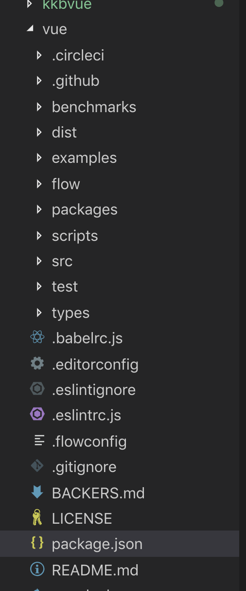

# Vue原理剖析


[TOC]


## 1. 课前准备

作业

1、下列关于vuex描述，不正确的是哪项？(C)[单选题]

A、Vuex 是一个状态管理模式

B、Vuex主要用于多视图间状态全局共享与管理

C、在Vuex中改变状态可以通过mutations和actions

D、Vuex通过Vue实现响应式，因此只能用于Vue

2、下列关于vue-router的描述，不正确的是哪项？(B)[单选题]

A、vue-router有hash和history两种模式

B、可以通过addRoutes和remoRoutes方法动态添加和删除路由

C、可以通过beforeEnter进行路由守卫

D、vue-router之所以能够通过修改hash或者path更新内容，是因为借助了Vue的响应式原理

3、关于typescript在vue中的应用，哪项说法是不正确的？(C)[单选题]

A、使用TypeScript可获得静态类型检查以及最新的ECMAScript特性

B、TypeScript是JavaScript类型的超集，它可以编译成纯JavaScript。意味着你完全可以用JS语法编写TS代码

C、使用Vue.extend({})方式声明组件不能获得TypeScript类型推断能力

D、基于类的Vue组件中如果要声明初始数据可以直接声明为实例的属性，如：`message: string = 'Hello!'`

4、下列关于vue说法哪些是不正确的？(B)[单选题]

A、vue简单易上手，性能高效，还便于与第三方库或既有项目整合

B、vue构建的项目复杂度增加较快，仅适合中小型项目

C、vue基于组件构建应用，代码组织简洁、易理解、易维护

D、vue借助虚拟DOM实现跨平台，服务端渲染，以及性能良好的DOM更新策略

5、下列关于vue-cli说法哪些是不正确的？（BC）[多选]

A、vue-cli3内部用的webpack来开发

B、vue-cli3自己没法实现数据mock，需要借助easy-mock等平台

C、vue-cli3包含开发的所有功能，基本不需要定制

D、工程化是为了提高开发效率，还可以完成部分实现性能优化的能力

E、npm run test和npm run pretest posttest是两个有先后顺序的命令


## 2. 课堂主题

Vue源码

## 3. 课堂目标

知其然，也知其所以然


## 4. 知识点

### 文件结构




### 入口

package.json, main是require的入口，module是import的入口

```json
  "main": "dist/vue.runtime.common.js",
  "module": "dist/vue.runtime.esm.js",
```

dist是build后产生的，"build": "node scripts/build.js",

所以npm run build执行的事build.js

```js
let builds = require('./config').getAllBuilds()

// filter builds via command line arg
if (process.argv[2]) {
  const filters = process.argv[2].split(',')
  builds = builds.filter(b => {
    return filters.some(f => b.output.file.indexOf(f) > -1 || b._name.indexOf(f) > -1)
  })
} else {
  // filter out weex builds by default
  builds = builds.filter(b => {
    return b.output.file.indexOf('weex') === -1
  })
}

build(builds)
```


config.js

```js

const builds = {
  // Runtime only (CommonJS). Used by bundlers e.g. Webpack & Browserify
  'web-runtime-cjs': {
    entry: resolve('web/entry-runtime.js'),
    dest: resolve('dist/vue.runtime.common.js'),
    format: 'cjs',
    banner
  },
  // Runtime+compiler CommonJS build (CommonJS)
  'web-full-cjs': {
    entry: resolve('web/entry-runtime-with-compiler.js'),
    dest: resolve('dist/vue.common.js'),
    format: 'cjs',
    alias: { he: './entity-decoder' },
    banner
  },
  // Runtime only (ES Modules). Used by bundlers that support ES Modules,
  // e.g. Rollup & Webpack 2
  'web-runtime-esm': {
    entry: resolve('web/entry-runtime.js'),
    dest: resolve('dist/vue.runtime.esm.js'),
    format: 'es',
    banner
  },
  // Runtime+compiler CommonJS build (ES Modules)
  'web-full-esm': {
    entry: resolve('web/entry-runtime-with-compiler.js'),
    dest: resolve('dist/vue.esm.js'),
    format: 'es',
    alias: { he: './entity-decoder' },
    banner
  },
```

cjs是commonjs规范，es标识ES module规范， umd是Universal Module Definition 规范

入口是 src/platforms/web/entry-runtime-with-compiler.js

```js

import config from 'core/config'
import { warn, cached } from 'core/util/index'
import { mark, measure } from 'core/util/perf'

import Vue from './runtime/index'
import { query } from './util/index'
import { compileToFunctions } from './compiler/index'
import { shouldDecodeNewlines, shouldDecodeNewlinesForHref } from './util/compat'

const idToTemplate = cached(id => {
  const el = query(id)
  return el && el.innerHTML
})

const mount = Vue.prototype.$mount
Vue.prototype.$mount = function (
重写$Mount
```


runtime/index

```js
最初定义

import Vue from 'core/index'
Vue.prototype.$mount = function (
  el?: string | Element,
  hydrating?: boolean
): Component {
  el = el && inBrowser ? query(el) : undefined
  return mountComponent(this, el, hydrating)
}
```


core/index

```js
import Vue from './instance/index'
import { initGlobalAPI } from './global-api/index'
import { isServerRendering } from 'core/util/env'
import { FunctionalRenderContext } from 'core/vdom/create-functional-component'

initGlobalAPI(Vue)

```

instance/index终于找到

```js
import { initMixin } from './init'
import { stateMixin } from './state'
import { renderMixin } from './render'
import { eventsMixin } from './events'
import { lifecycleMixin } from './lifecycle'
import { warn } from '../util/index'

function Vue (options) {
  if (process.env.NODE_ENV !== 'production' &&
    !(this instanceof Vue)
  ) {
    warn('Vue is a constructor and should be called with the `new` keyword')
  }
  this._init(options)
}

initMixin(Vue)
stateMixin(Vue)
eventsMixin(Vue)
lifecycleMixin(Vue)
renderMixin(Vue)

export default Vue
```


说明我们new Vue的时候，执行的事这个_inti方法 并且有一大堆函数对Vue做扩展，咱们挨个去体验下


#### Compiler VS Runtime

执行的时候支持template选项，执行的时候编译模板，就是compiler模块

runtime就是不支持template，体积小，需要借助webpack把template解析为render函数


### initGlobalAPI

```js
export function initGlobalAPI (Vue: GlobalAPI) {
  // config
  const configDef = {}
  configDef.get = () => config
  if (process.env.NODE_ENV !== 'production') {
    configDef.set = () => {
      warn(
        'Do not replace the Vue.config object, set individual fields instead.'
      )
    }
  }
  Object.defineProperty(Vue, 'config', configDef)

  // exposed util methods.
  // NOTE: these are not considered part of the public API - avoid relying on
  // them unless you are aware of the risk.
  Vue.util = {
    warn,
    extend,
    mergeOptions,
    defineReactive
  }

  Vue.set = set
  Vue.delete = del
  Vue.nextTick = nextTick

  Vue.options = Object.create(null)
  ASSET_TYPES.forEach(type => {
    Vue.options[type + 's'] = Object.create(null)
  })

  // this is used to identify the "base" constructor to extend all plain-object
  // components with in Weex's multi-instance scenarios.
  Vue.options._base = Vue

  extend(Vue.options.components, builtInComponents)

  initUse(Vue)
  initMixin(Vue)
  initExtend(Vue)
  initAssetRegisters(Vue)
}
```


#### initUse

Vue.use 插件机制的源码

```js
export function initUse (Vue: GlobalAPI) {
  Vue.use = function (plugin: Function | Object) {
    const installedPlugins = (this._installedPlugins || (this._installedPlugins = []))
    if (installedPlugins.indexOf(plugin) > -1) {
      return this
    }

    // additional parameters
    const args = toArray(arguments, 1)
    args.unshift(this)
    if (typeof plugin.install === 'function') {
      plugin.install.apply(plugin, args)
    } else if (typeof plugin === 'function') {
      plugin.apply(null, args)
    }
    installedPlugins.push(plugin)
    return this
  }
}

```


#### mixins

```js
/* @flow */

import { mergeOptions } from '../util/index'

export function initMixin (Vue: GlobalAPI) {
  Vue.mixin = function (mixin: Object) {
    this.options = mergeOptions(this.options, mixin)
    return this
  }
}

```

其实就是个参数合并，把配置合并到this.options上

#### extends

```js
  Vue.extend = function (extendOptions: Object): Function {
    extendOptions = extendOptions || {}
    const Super = this
    const SuperId = Super.cid
    const cachedCtors = extendOptions._Ctor || (extendOptions._Ctor = {})
    if (cachedCtors[SuperId]) {
      return cachedCtors[SuperId]
    }

    const name = extendOptions.name || Super.options.name
    if (process.env.NODE_ENV !== 'production' && name) {
      validateComponentName(name)
    }

    const Sub = function VueComponent (options) {
      this._init(options)
    }
    Sub.prototype = Object.create(Super.prototype)
    Sub.prototype.constructor = Sub
```

mixin合并属性，  extend创建组件的构造函数,为了复用


### init

src/core/instance/init.js

逻辑很清晰 各个初始化，每个扩展逻辑写成单独的函数，值得学习

```js
export function initMixin (Vue: Class<Component>) {
  Vue.prototype._init = function (options?: Object) {
    const vm: Component = this
    // a uid
    vm._uid = uid++

    let startTag, endTag
    /* istanbul ignore if */
    if (process.env.NODE_ENV !== 'production' && config.performance && mark) {
      startTag = `vue-perf-start:${vm._uid}`
      endTag = `vue-perf-end:${vm._uid}`
      mark(startTag)
    }

    // a flag to avoid this being observed
    vm._isVue = true
    // merge options
    if (options && options._isComponent) {
      // optimize internal component instantiation
      // since dynamic options merging is pretty slow, and none of the
      // internal component options needs special treatment.
      initInternalComponent(vm, options)
    } else {
      vm.$options = mergeOptions(
        resolveConstructorOptions(vm.constructor),
        options || {},
        vm
      )
    }
    /* istanbul ignore else */
    if (process.env.NODE_ENV !== 'production') {
      initProxy(vm)
    } else {
      vm._renderProxy = vm
    }
    // expose real self
    vm._self = vm
    // 生命周期
    initLifecycle(vm)
    // 事件
    initEvents(vm)
    // 渲染
    initRender(vm)
    // 生命周期钩子
    callHook(vm, 'beforeCreate')
    // injections
    initInjections(vm) // resolve injections before data/props
    // state
    initState(vm)
    // provide
    initProvide(vm) // resolve provide after data/props
    // 生命周期
    callHook(vm, 'created')

    /* istanbul ignore if */
    if (process.env.NODE_ENV !== 'production' && config.performance && mark) {
      vm._name = formatComponentName(vm, false)
      mark(endTag)
      measure(`vue ${vm._name} init`, startTag, endTag)
    }
    // 如果new的时候有el ，就调用$mount ， 和咱们手动调用$mount是一个意思
    if (vm.$options.el) {
      vm.$mount(vm.$options.el)
    }
  }
}
```

#### mountComponent

$Mount时间就是执行了mountComponent， src/core/instance/lifecycle.js + runtime/index

```js
Vue.prototype.$mount = function (
  el?: string | Element,
  hydrating?: boolean
): Component {
  el = el && inBrowser ? query(el) : undefined
  return mountComponent(this, el, hydrating)
}
```

```js
export function mountComponent (
  vm: Component,
  el: ?Element,
  hydrating?: boolean
): Component {
  vm.$el = el
  if (!vm.$options.render) {
    vm.$options.render = createEmptyVNode
    if (process.env.NODE_ENV !== 'production') {
      /* istanbul ignore if */
      if ((vm.$options.template && vm.$options.template.charAt(0) !== '#') ||
        vm.$options.el || el) {
        warn(
          'You are using the runtime-only build of Vue where the template ' +
          'compiler is not available. Either pre-compile the templates into ' +
          'render functions, or use the compiler-included build.',
          vm
        )
      } else {
        warn(
          'Failed to mount component: template or render function not defined.',
          vm
        )
      }
    }
  }
  callHook(vm, 'beforeMount')

  let updateComponent
  /* istanbul ignore if */
  if (process.env.NODE_ENV !== 'production' && config.performance && mark) {
  } else {
    updateComponent = () => {
      vm._update(vm._render(), hydrating)
    }
  }

  // we set this to vm._watcher inside the watcher's constructor
  // since the watcher's initial patch may call $forceUpdate (e.g. inside child
  // component's mounted hook), which relies on vm._watcher being already defined
  new Watcher(vm, updateComponent, noop, {
    before () {
      if (vm._isMounted) {
        callHook(vm, 'beforeUpdate')
      }
    }
  }, true /* isRenderWatcher */)

  // manually mounted instance, call mounted on self
  // mounted is called for render-created child components in its inserted hook
  if (vm.$vnode == null) {
    vm._isMounted = true
    callHook(vm, 'mounted')
  }
  return vm
}
```

大部分都是调试代码，重点有这么几个

Watcher， _render, _update

_render生成虚拟dom， update负责更新dom


### stateMixin

挂载$data,$props, $set,$delete, $watch  （新建一个￥watch）

```js
export function stateMixin (Vue: Class<Component>) {
  // flow somehow has problems with directly declared definition object
  // when using Object.defineProperty, so we have to procedurally build up
  // the object here.
  const dataDef = {}
  dataDef.get = function () { return this._data }
  const propsDef = {}
  propsDef.get = function () { return this._props }
  if (process.env.NODE_ENV !== 'production') {
    dataDef.set = function () {
      warn(
        'Avoid replacing instance root $data. ' +
        'Use nested data properties instead.',
        this
      )
    }
    propsDef.set = function () {
      warn(`$props is readonly.`, this)
    }
  }
  Object.defineProperty(Vue.prototype, '$data', dataDef)
  Object.defineProperty(Vue.prototype, '$props', propsDef)

  Vue.prototype.$set = set
  Vue.prototype.$delete = del

  Vue.prototype.$watch = function (
    expOrFn: string | Function,
    cb: any,
    options?: Object
  ): Function {
    const vm: Component = this
    if (isPlainObject(cb)) {
      return createWatcher(vm, expOrFn, cb, options)
    }
    options = options || {}
    options.user = true
    const watcher = new Watcher(vm, expOrFn, cb, options)
    if (options.immediate) {
      try {
        cb.call(vm, watcher.value)
      } catch (error) {
        handleError(error, vm, `callback for immediate watcher "${watcher.expression}"`)
      }
    }
    return function unwatchFn () {
      watcher.teardown()
    }
  }
}

```


### eventsMixin

$On $emit $off $once

```js
export function eventsMixin (Vue: Class<Component>) {
  const hookRE = /^hook:/
  Vue.prototype.$on = function (event: string | Array<string>, fn: Function): Component {
    const vm: Component = this
    if (Array.isArray(event)) {
      for (let i = 0, l = event.length; i < l; i++) {
        vm.$on(event[i], fn)
      }
    } else {
      (vm._events[event] || (vm._events[event] = [])).push(fn)
      // optimize hook:event cost by using a boolean flag marked at registration
      // instead of a hash lookup
      if (hookRE.test(event)) {
        vm._hasHookEvent = true
      }
    }
    return vm
  }

  Vue.prototype.$once = function (event: string, fn: Function): Component {
    const vm: Component = this
    function on () {
      vm.$off(event, on)
      fn.apply(vm, arguments)
    }
    on.fn = fn
    vm.$on(event, on)
    return vm
  }

  Vue.prototype.$off = function (event?: string | Array<string>, fn?: Function): Component {
    const vm: Component = this
    // all
    if (!arguments.length) {
      vm._events = Object.create(null)
      return vm
    }
    // array of events
    if (Array.isArray(event)) {
      for (let i = 0, l = event.length; i < l; i++) {
        vm.$off(event[i], fn)
      }
      return vm
    }
    // specific event
    const cbs = vm._events[event]
    if (!cbs) {
      return vm
    }
    if (!fn) {
      vm._events[event] = null
      return vm
    }
    if (fn) {
      // specific handler
      let cb
      let i = cbs.length
      while (i--) {
        cb = cbs[i]
        if (cb === fn || cb.fn === fn) {
          cbs.splice(i, 1)
          break
        }
      }
    }
    return vm
  }

  Vue.prototype.$emit = function (event: string): Component {
    const vm: Component = this
    if (process.env.NODE_ENV !== 'production') {
      const lowerCaseEvent = event.toLowerCase()
      if (lowerCaseEvent !== event && vm._events[lowerCaseEvent]) {
        tip(
          `Event "${lowerCaseEvent}" is emitted in component ` +
          `${formatComponentName(vm)} but the handler is registered for "${event}". ` +
          `Note that HTML attributes are case-insensitive and you cannot use ` +
          `v-on to listen to camelCase events when using in-DOM templates. ` +
          `You should probably use "${hyphenate(event)}" instead of "${event}".`
        )
      }
    }
    let cbs = vm._events[event]
    if (cbs) {
      cbs = cbs.length > 1 ? toArray(cbs) : cbs
      const args = toArray(arguments, 1)
      for (let i = 0, l = cbs.length; i < l; i++) {
        try {
          cbs[i].apply(vm, args)
        } catch (e) {
          handleError(e, vm, `event handler for "${event}"`)
        }
      }
    }
    return vm
  }
}
```


### renderMixin

This._render 把实例渲染成虚拟dom， 最关键的就是  vnode = render.call(vm._renderProxy, vm.$createElement)，render是template解析后的结果，编译的过程后面再说，大概意思就是template里的html ，被createElement解析为虚拟dom，在这里执行  注意参数就是​$createELmenet

所以模板这么写


```html
<div id="app">
  {{ name }}
</div>
```

 会解析为 我们常把createElement简写h，所以的虚拟dom，就是用js的对象去描述一个标签 一个object

```js
render: function (createElement) {
  return createElement('div', {
     attrs: {
        id: 'app'
      },
  }, this.name)
}
```

所以_render执行createElement 返回的事vnode对象

```js

  // install runtime convenience helpers
  installRenderHelpers(Vue.prototype)

  Vue.prototype.$nextTick = function (fn: Function) {
    return nextTick(fn, this)
  }

  Vue.prototype._render = function (): VNode {
    const vm: Component = this
    const { render, _parentVnode } = vm.$options

    if (_parentVnode) {
      vm.$scopedSlots = _parentVnode.data.scopedSlots || emptyObject
    }

    // set parent vnode. this allows render functions to have access
    // to the data on the placeholder node.
    vm.$vnode = _parentVnode
    // render self
    let vnode
    try {
      vnode = render.call(vm._renderProxy, vm.$createElement)
    } catch (e) {
      handleError(e, vm, `render`)
      // return error render result,
      // or previous vnode to prevent render error causing blank component
      /* istanbul ignore else */
      if (process.env.NODE_ENV !== 'production' && vm.$options.renderError) {
        try {
          vnode = vm.$options.renderError.call(vm._renderProxy, vm.$createElement, e)
        } catch (e) {
          handleError(e, vm, `renderError`)
          vnode = vm._vnode
        }
      } else {
        vnode = vm._vnode
      }
    }
    // return empty vnode in case the render function errored out
    if (!(vnode instanceof VNode)) {
      if (process.env.NODE_ENV !== 'production' && Array.isArray(vnode)) {
        warn(
          'Multiple root nodes returned from render function. Render function ' +
          'should return a single root node.',
          vm
        )
      }
      vnode = createEmptyVNode()
    }
    // set parent
    vnode.parent = _parentVnode
    return vnode
  }
}
```

#### createElement

src/core/vdom/create-elemenet.js


先看下React课里咱们手写的createElement，思路是一样的，用object来取代真实的dom对象，提高性能

```js
// 第一个核心api 构建虚拟dom的object
export default function createElement(type, props, ...children) {
	let vtype = null
	if (typeof type === 'string') {
		vtype = VELEMENT
	} else if (typeof type === 'function') {
		if (type && type.isReactComponent) {
			vtype = VCOMPONENT
		} else {
			vtype = VSTATELESS
		}
	} else {
		throw new Error(`React.createElement: unexpect type [ ${type} ]`)
	}

	finalProps.children = children

	return createVnode(vtype, type, finalProps, key, ref)
}

```

```js
// 创建vnode
export function createVnode(vtype, type, props, key, ref) {
    // 创建vnode
    let vnode = {
        vtype: vtype,
        type: type,
        props: props,
        refs: refs,
        key: key,
        ref: ref,
    }
    if (vtype === VSTATELESS || vtype === VCOMPONENT) {
        vnode.uid = _.getUid()
    }
    return vnode
}
```

createElement返回一个Vnode实例

```js
/* @flow */

export default class VNode {
  tag: string | void;
  data: VNodeData | void;
  children: ?Array<VNode>;
  text: string | void;
  elm: Node | void;
  ns: string | void;
  context: Component | void; // rendered in this component's scope
  key: string | number | void;
  componentOptions: VNodeComponentOptions | void;
  componentInstance: Component | void; // component instance
  parent: VNode | void; // component placeholder node

  // strictly internal
  raw: boolean; // contains raw HTML? (server only)
  isStatic: boolean; // hoisted static node
  isRootInsert: boolean; // necessary for enter transition check
  isComment: boolean; // empty comment placeholder?
  isCloned: boolean; // is a cloned node?
  isOnce: boolean; // is a v-once node?
  asyncFactory: Function | void; // async component factory function
  asyncMeta: Object | void;
  isAsyncPlaceholder: boolean;
  ssrContext: Object | void;
  fnContext: Component | void; // real context vm for functional nodes
  fnOptions: ?ComponentOptions; // for SSR caching
  devtoolsMeta: ?Object; // used to store functional render context for devtools
  fnScopeId: ?string; // functional scope id support

  constructor (
    tag?: string,
    data?: VNodeData,
    children?: ?Array<VNode>,
    text?: string,
    elm?: Node,
    context?: Component,
    componentOptions?: VNodeComponentOptions,
    asyncFactory?: Function
  ) {
    this.tag = tag
    this.data = data
    this.children = children
    this.text = text
    this.elm = elm
    this.ns = undefined
    this.context = context
    this.fnContext = undefined
    this.fnOptions = undefined
    this.fnScopeId = undefined
    this.key = data && data.key
    this.componentOptions = componentOptions
    this.componentInstance = undefined
    this.parent = undefined
    this.raw = false
    this.isStatic = false
    this.isRootInsert = true
    this.isComment = false
    this.isCloned = false
    this.isOnce = false
    this.asyncFactory = asyncFactory
    this.asyncMeta = undefined
    this.isAsyncPlaceholder = false
  }
```

createElement递归调用，最后会返回一个tree， 一个vnode是一个obj，描述元素，children还是Vnode，构成一个树

下面咱们来看下把这个object渲染出来 就是update的过程


### lifecycleMixin

this._update $forceUpdate, $destory，rrc/core/instance/lifecycle.js

首次渲染和更新，都是update

```js
export function lifecycleMixin (Vue: Class<Component>) {
  Vue.prototype._update = function (vnode: VNode, hydrating?: boolean) {
    const vm: Component = this
    const prevEl = vm.$el
    const prevVnode = vm._vnode
    const restoreActiveInstance = setActiveInstance(vm)
    vm._vnode = vnode
    // Vue.prototype.__patch__ is injected in entry points
    // based on the rendering backend used.
    if (!prevVnode) {
      // initial render
      vm.$el = vm.__patch__(vm.$el, vnode, hydrating, false /* removeOnly */)
    } else {
      // updates
      vm.$el = vm.__patch__(prevVnode, vnode)
    }
    restoreActiveInstance()
    // update __vue__ reference
    if (prevEl) {
      prevEl.__vue__ = null
    }
    if (vm.$el) {
      vm.$el.__vue__ = vm
    }
    // if parent is an HOC, update its $el as well
    if (vm.$vnode && vm.$parent && vm.$vnode === vm.$parent._vnode) {
      vm.$parent.$el = vm.$el
    }
    // updated hook is called by the scheduler to ensure that children are
    // updated in a parent's updated hook.
  }

  Vue.prototype.$forceUpdate = function () {
    const vm: Component = this
    if (vm._watcher) {
      vm._watcher.update()
    }
  }

  Vue.prototype.$destroy = function () {
    const vm: Component = this
    if (vm._isBeingDestroyed) {
      return
    }
    callHook(vm, 'beforeDestroy')
    vm._isBeingDestroyed = true
    // remove self from parent
    const parent = vm.$parent
    if (parent && !parent._isBeingDestroyed && !vm.$options.abstract) {
      remove(parent.$children, vm)
    }
    // teardown watchers
    if (vm._watcher) {
      vm._watcher.teardown()
    }
    let i = vm._watchers.length
    while (i--) {
      vm._watchers[i].teardown()
    }
    // remove reference from data ob
    // frozen object may not have observer.
    if (vm._data.__ob__) {
      vm._data.__ob__.vmCount--
    }
    // call the last hook...
    vm._isDestroyed = true
    // invoke destroy hooks on current rendered tree
    vm.__patch__(vm._vnode, null)
    // fire destroyed hook
    callHook(vm, 'destroyed')
    // turn off all instance listeners.
    vm.$off()
    // remove __vue__ reference
    if (vm.$el) {
      vm.$el.__vue__ = null
    }
    // release circular reference (#6759)
    if (vm.$vnode) {
      vm.$vnode.parent = null
    }
  }
}
```

核心就是这一段

```js
  if (!prevVnode) {
    // initial render
    vm.$el = vm.__patch__(vm.$el, vnode, hydrating, false /* removeOnly */)
  } else {
    // updates
    vm.$el = vm.__patch__(prevVnode, vnode)
  }
```

初次渲染和更新，__patch__参数不同， src/platforms/web/runtime/index.js

```js
Vue.prototype.__patch__ = inBrowser ? patch : noop
```

实际就是createPatchFunction的返回值，传递nodeOps和modules 

```js
export const patch: Function = createPatchFunction({ nodeOps, modules })
```


web/runtime/node-ops 各种dom操作方法

`modules` 定义了一些模块的钩子函数的实现

```js
export default [
  attrs,
  klass,
  events,
  domProps,
  style,
  transition
]

```


patch是一个逻辑贼复杂的模块，我们先从宏观看

```js
var app = new Vue({
  el: '#app',
  render: function (createElement) {
    return createElement('div', {
      attrs: {
        id: 'app'
      },
    }, this.name)
  },
  data: {
    name: 'Hello kaikeba!'
  }
})

vm.$el = vm.__patch__(vm.$el, vnode, hydrating, false /* removeOnly */)
```

const hooks = ['create', 'activate', 'update', 'remove', 'destroy'], 

```js
createPatchFunction(){
    //通过虚拟节点创建真实的 DOM 并插入到它的父节点中
    createElm
    // 尝试创建子组件
    createComponent
    // 初始化组件
    initComponent
    // dom插入
  	insert
    // 创建子元素 实际上是遍历子虚拟节点，递归调用 createElm (DFS)
    createChildren
    // 执行create钩子， vnode进队列
    invokeCreateHooks
    addVnodes
    invokeDestroyHook
    removeVnodes
    updateChildren
    checkDuplicateKeys
    patchVnode
    hydrate(sst)
}
```

```js
    while (oldStartIdx <= oldEndIdx && newStartIdx <= newEndIdx) {
      if (isUndef(oldStartVnode)) {
        oldStartVnode = oldCh[++oldStartIdx] // Vnode has been moved left
      } else if (isUndef(oldEndVnode)) {
        oldEndVnode = oldCh[--oldEndIdx]
      } else if (sameVnode(oldStartVnode, newStartVnode)) {
        patchVnode(oldStartVnode, newStartVnode, insertedVnodeQueue, newCh, newStartIdx)
        oldStartVnode = oldCh[++oldStartIdx]
        newStartVnode = newCh[++newStartIdx]
      } else if (sameVnode(oldEndVnode, newEndVnode)) {
        patchVnode(oldEndVnode, newEndVnode, insertedVnodeQueue, newCh, newEndIdx)
        oldEndVnode = oldCh[--oldEndIdx]
        newEndVnode = newCh[--newEndIdx]
      } else if (sameVnode(oldStartVnode, newEndVnode)) { // Vnode moved right
        patchVnode(oldStartVnode, newEndVnode, insertedVnodeQueue, newCh, newEndIdx)
        canMove && nodeOps.insertBefore(parentElm, oldStartVnode.elm, nodeOps.nextSibling(oldEndVnode.elm))
        oldStartVnode = oldCh[++oldStartIdx]
        newEndVnode = newCh[--newEndIdx]
      } else if (sameVnode(oldEndVnode, newStartVnode)) { // Vnode moved left
        patchVnode(oldEndVnode, newStartVnode, insertedVnodeQueue, newCh, newStartIdx)
        canMove && nodeOps.insertBefore(parentElm, oldEndVnode.elm, oldStartVnode.elm)
        oldEndVnode = oldCh[--oldEndIdx]
        newStartVnode = newCh[++newStartIdx]
      } else {
        if (isUndef(oldKeyToIdx)) oldKeyToIdx = createKeyToOldIdx(oldCh, oldStartIdx, oldEndIdx)
        idxInOld = isDef(newStartVnode.key)
          ? oldKeyToIdx[newStartVnode.key]
          : findIdxInOld(newStartVnode, oldCh, oldStartIdx, oldEndIdx)
        if (isUndef(idxInOld)) { // New element
          createElm(newStartVnode, insertedVnodeQueue, parentElm, oldStartVnode.elm, false, newCh, newStartIdx)
        } else {
          vnodeToMove = oldCh[idxInOld]
          if (sameVnode(vnodeToMove, newStartVnode)) {
            patchVnode(vnodeToMove, newStartVnode, insertedVnodeQueue, newCh, newStartIdx)
            oldCh[idxInOld] = undefined
            canMove && nodeOps.insertBefore(parentElm, vnodeToMove.elm, oldStartVnode.elm)
          } else {
            // same key but different element. treat as new element
            createElm(newStartVnode, insertedVnodeQueue, parentElm, oldStartVnode.elm, false, newCh, newStartIdx)
          }
        }
        newStartVnode = newCh[++newStartIdx]
      }
    }
```


```js
  return function patch (oldVnode, vnode, hydrating, removeOnly) {
    if (isUndef(vnode)) {
      if (isDef(oldVnode)) invokeDestroyHook(oldVnode)
      return
    }

    let isInitialPatch = false
    const insertedVnodeQueue = []

    if (isUndef(oldVnode)) {
      // empty mount (likely as component), create new root element
      isInitialPatch = true
      createElm(vnode, insertedVnodeQueue)
    } else {
      const isRealElement = isDef(oldVnode.nodeType)
      if (!isRealElement && sameVnode(oldVnode, vnode)) {
        // patch existing root node
        patchVnode(oldVnode, vnode, insertedVnodeQueue, null, null, removeOnly)
      } else {
        if (isRealElement) {
          // mounting to a real element
          // check if this is server-rendered content and if we can perform
          // a successful hydration.
          if (oldVnode.nodeType === 1 && oldVnode.hasAttribute(SSR_ATTR)) {
            oldVnode.removeAttribute(SSR_ATTR)
            hydrating = true
          }
          if (isTrue(hydrating)) {
            if (hydrate(oldVnode, vnode, insertedVnodeQueue)) {
              invokeInsertHook(vnode, insertedVnodeQueue, true)
              return oldVnode
            } else if (process.env.NODE_ENV !== 'production') {
              warn(
                'The client-side rendered virtual DOM tree is not matching ' +
                'server-rendered content. This is likely caused by incorrect ' +
                'HTML markup, for example nesting block-level elements inside ' +
                '<p>, or missing <tbody>. Bailing hydration and performing ' +
                'full client-side render.'
              )
            }
          }
          // either not server-rendered, or hydration failed.
          // create an empty node and replace it
          oldVnode = emptyNodeAt(oldVnode)
        }

        // replacing existing element
        const oldElm = oldVnode.elm
        const parentElm = nodeOps.parentNode(oldElm)

        // create new node
        createElm(
          vnode,
          insertedVnodeQueue,
          // extremely rare edge case: do not insert if old element is in a
          // leaving transition. Only happens when combining transition +
          // keep-alive + HOCs. (#4590)
          oldElm._leaveCb ? null : parentElm,
          nodeOps.nextSibling(oldElm)
        )

        // update parent placeholder node element, recursively
        if (isDef(vnode.parent)) {
          let ancestor = vnode.parent
          const patchable = isPatchable(vnode)
          while (ancestor) {
            for (let i = 0; i < cbs.destroy.length; ++i) {
              cbs.destroy[i](ancestor)
            }
            ancestor.elm = vnode.elm
            if (patchable) {
              for (let i = 0; i < cbs.create.length; ++i) {
                cbs.create[i](emptyNode, ancestor)
              }
              // #6513
              // invoke insert hooks that may have been merged by create hooks.
              // e.g. for directives that uses the "inserted" hook.
              const insert = ancestor.data.hook.insert
              if (insert.merged) {
                // start at index 1 to avoid re-invoking component mounted hook
                for (let i = 1; i < insert.fns.length; i++) {
                  insert.fns[i]()
                }
              }
            } else {
              registerRef(ancestor)
            }
            ancestor = ancestor.parent
          }
        }

        // destroy old node
        if (isDef(parentElm)) {
          removeVnodes(parentElm, [oldVnode], 0, 0)
        } else if (isDef(oldVnode.tag)) {
          invokeDestroyHook(oldVnode)
        }
      }
    }

    invokeInsertHook(vnode, insertedVnodeQueue, isInitialPatch)
    return vnode.elm
  }
```


1. new Vue
2. init
3. $Mount
4. compile
5. render
6. vnode
7. patch
8. dom

虚拟dom这块，参考全栈课react的课件

react.shengxinjing.cn


###  组件化

vdom里，葡萄皮那个元素createElement, 组件用createComponent新建组件

create-element

```js
  if (typeof tag === 'string') {
      真是的dom
    let Ctor
    ns = (context.$vnode && context.$vnode.ns) || config.getTagNamespace(tag)
    if (config.isReservedTag(tag)) {
      // platform built-in elements
      vnode = new VNode(
        config.parsePlatformTagName(tag), data, children,
        undefined, undefined, context
      )
    } else if ((!data || !data.pre) && isDef(Ctor = resolveAsset(context.$options, 'components', tag))) {
      // component
      vnode = createComponent(Ctor, data, context, children, tag)
    } else {
      // unknown or unlisted namespaced elements
      // check at runtime because it may get assigned a namespace when its
      // parent normalizes children
      vnode = new VNode(
        tag, data, children,
        undefined, undefined, context
      )
    }
  } else {
    // direct component options / constructor
    vnode = createComponent(tag, data, context, children)
  }
```

####  [snabbdom](https://github.com/snabbdom/snabbdom)


#### createComponent

vdom/create-component 先看核心流程

```js
installComponentHooks // 钩子
实例化VNode 
  const name = Ctor.options.name || tag
  const vnode = new VNode(
    `vue-component-${Ctor.cid}${name ? `-${name}` : ''}`,
    data, undefined, undefined, undefined, context,
    { Ctor, propsData, listeners, tag, children },
    asyncFactory
  )
```

```js
export function createComponent (
  Ctor: Class<Component> | Function | Object | void,
  data: ?VNodeData,
  context: Component,
  children: ?Array<VNode>,
  tag?: string
): VNode | Array<VNode> | void {
  if (isUndef(Ctor)) {
    return
  }

  const baseCtor = context.$options._base

  // plain options object: turn it into a constructor
  if (isObject(Ctor)) {
    Ctor = baseCtor.extend(Ctor)
  }

  // if at this stage it's not a constructor or an async component factory,
  // reject.
  if (typeof Ctor !== 'function') {
    if (process.env.NODE_ENV !== 'production') {
      warn(`Invalid Component definition: ${String(Ctor)}`, context)
    }
    return
  }

  // async component
  let asyncFactory
  if (isUndef(Ctor.cid)) {
    asyncFactory = Ctor
    Ctor = resolveAsyncComponent(asyncFactory, baseCtor, context)
    if (Ctor === undefined) {
      // return a placeholder node for async component, which is rendered
      // as a comment node but preserves all the raw information for the node.
      // the information will be used for async server-rendering and hydration.
      return createAsyncPlaceholder(
        asyncFactory,
        data,
        context,
        children,
        tag
      )
    }
  }

  data = data || {}

  // resolve constructor options in case global mixins are applied after
  // component constructor creation
  resolveConstructorOptions(Ctor)

  // transform component v-model data into props & events
  if (isDef(data.model)) {
    transformModel(Ctor.options, data)
  }

  // extract props
  const propsData = extractPropsFromVNodeData(data, Ctor, tag)

  // functional component
  if (isTrue(Ctor.options.functional)) {
    return createFunctionalComponent(Ctor, propsData, data, context, children)
  }

  // extract listeners, since these needs to be treated as
  // child component listeners instead of DOM listeners
  const listeners = data.on
  // replace with listeners with .native modifier
  // so it gets processed during parent component patch.
  data.on = data.nativeOn

  if (isTrue(Ctor.options.abstract)) {
    // abstract components do not keep anything
    // other than props & listeners & slot

    // work around flow
    const slot = data.slot
    data = {}
    if (slot) {
      data.slot = slot
    }
  }

  // install component management hooks onto the placeholder node
  installComponentHooks(data)

  // return a placeholder vnode
  const name = Ctor.options.name || tag
  const vnode = new VNode(
    `vue-component-${Ctor.cid}${name ? `-${name}` : ''}`,
    data, undefined, undefined, undefined, context,
    { Ctor, propsData, listeners, tag, children },
    asyncFactory
  )

  // Weex specific: invoke recycle-list optimized @render function for
  // extracting cell-slot template.
  // https://github.com/Hanks10100/weex-native-directive/tree/master/component
  /* istanbul ignore if */
  if (__WEEX__ && isRecyclableComponent(vnode)) {
    return renderRecyclableComponentTemplate(vnode)
  }

  return vnode
}
```

createComponent返回vnode，进入到_update的逻辑


### 生命周期

一图胜好多字 ，好多地方看到callHook，src/core/instance/lifecycle ，回到core/instance/int.js中，能看到befoireCreate和created调用的时机

 `beforeCreate` 和 `created` 是在 `initState` 的前后，`initState` 的作用是初始化 `props`、`data`、`methods`、`watch`、 等属性，那么显然 `beforeCreate` 的钩子函数中就不能获取到 `props`、`data` 中定义的值，也不能调用 `methods` 中定义的函数。原理一目了然

mountComponent中，beforeMount， beforeUpdate,callHook

可以看到_reder之前beforeMount， _update之后mounted， watch监听变化，触发beforeUpdate


### 组件注册

还记得ASSET_TYPES不，

```js
export const ASSET_TYPES = [
  'component',
  'directive',
  'filter'
]
```

Vue.components就来自于这里 `src/core/global-api/assets.js`


### 响应式

```js
Object.defineProperty(obj, prop, descriptor)
```

### 依赖收集

Watcher

### 编译

Compile

### 缺陷

数组方法拦截， object新对象

Vue.$set

src/core/observer/array.js


### 组件更新

```js
updateComponent = () => {
  vm._update(vm._render(), hydrating)
}
new Watcher(vm, updateComponent, noop, {
  before () {
    if (vm._isMounted) {
      callHook(vm, 'beforeUpdate')
    }
  }
}, true /* isRenderWatcher */)
```


### slot

插槽

`vm.$mount` 的时候，所以编译的顺序是先编译父组件，再编译子组件。

src/compiler/parser/index.js

普通插槽是在父组件编译和渲染阶段生成 `vnodes`，数据的作用域是父组件，子组件渲染的时候直接拿到这些渲染好的 `vnodes`。

作用域插槽，父组件在编译和渲染阶段并不会直接生成 `vnodes`，而是在父节点 保留一个 `scopedSlots` 对象，存储着不同名称的插槽以及它们对应的渲染函数，只有在编译和渲染子组件阶段才会执行这个渲染函数生成 `vnodes`，由于是在子组件环境执行的，所以对应的数据作用域是子组件实例。

简单地说，两种插槽的目的都是让子组件 `slot` 占位符生成的内容由父组件来决定，但数据的作用域会根据它们 `vnodes` 渲染时机不同而不同。

```js
function processSlot (el) {
  if (el.tag === 'slot') {
    el.slotName = getBindingAttr(el, 'name')
    if (process.env.NODE_ENV !== 'production' && el.key) {
      warn(
        `\`key\` does not work on <slot> because slots are abstract outlets ` +
        `and can possibly expand into multiple elements. ` +
        `Use the key on a wrapping element instead.`
      )
    }
  } else {
    let slotScope
    if (el.tag === 'template') {
      slotScope = getAndRemoveAttr(el, 'scope')
      /* istanbul ignore if */
      if (process.env.NODE_ENV !== 'production' && slotScope) {
        warn(
          `the "scope" attribute for scoped slots have been deprecated and ` +
          `replaced by "slot-scope" since 2.5. The new "slot-scope" attribute ` +
          `can also be used on plain elements in addition to <template> to ` +
          `denote scoped slots.`,
          true
        )
      }
      el.slotScope = slotScope || getAndRemoveAttr(el, 'slot-scope')
    } else if ((slotScope = getAndRemoveAttr(el, 'slot-scope'))) {
      /* istanbul ignore if */
      if (process.env.NODE_ENV !== 'production' && el.attrsMap['v-for']) {
        warn(
          `Ambiguous combined usage of slot-scope and v-for on <${el.tag}> ` +
          `(v-for takes higher priority). Use a wrapper <template> for the ` +
          `scoped slot to make it clearer.`,
          true
        )
      }
      el.slotScope = slotScope
    }
    const slotTarget = getBindingAttr(el, 'slot')
    if (slotTarget) {
      el.slotTarget = slotTarget === '""' ? '"default"' : slotTarget
      // preserve slot as an attribute for native shadow DOM compat
      // only for non-scoped slots.
      if (el.tag !== 'template' && !el.slotScope) {
        addAttr(el, 'slot', slotTarget)
      }
    }
  }
}
```


### keep-alive


内置组件 src/core/components/keep-alive.js

 `created` 钩子里定义了 `this.cache` 和 `this.keys`，它就是去缓存已经创建过的 `vnode`

`<keep-alive>` 直接实现了 `render` 函数，而不是我们常规模板的方式，执行 `<keep-alive>` 组件渲染的时候，就会执行到这个 `render` 函数

### vuex

看源码

### vue-router

看源码

### 

globalApi

initState

$mount

虚拟dom

 _render

_update

看一下react的上课课件 来学习虚拟dom


欢迎大家儿童节来开课吧


compiler

​	吧template编译成render函数  返回虚拟dom

​	如果没有compiler模块，文件变小，但是支持render写法

core

​	核心

platforms

​	平台  web,weex


server

​	服务端渲染相关

sfc

​	.vue文件解析

Shared

​	公用的方法和常量


## 6. 总结

Vue原理
不要怂 敢于去看
js基础


## 7. 作业
尝试去看

## 8. 问答

## 9. 预告
Vue性能优化
docker部署


